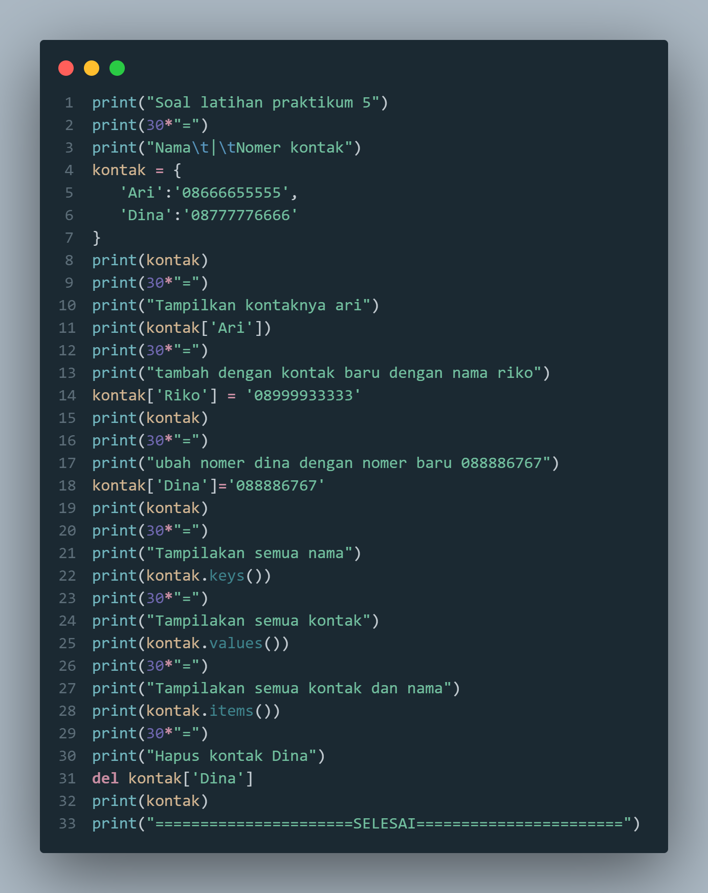
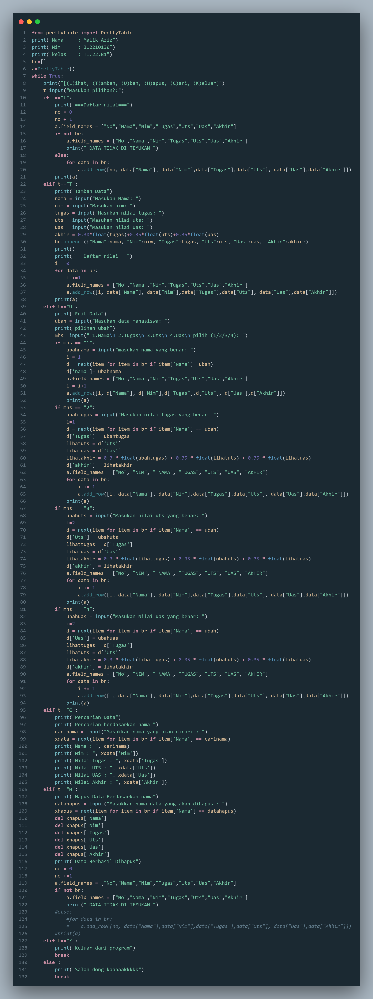
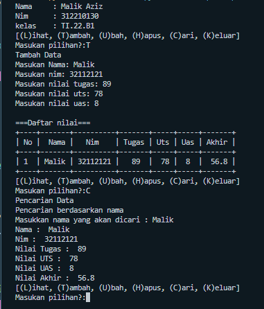
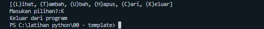

# LATIHAN DICTIONARY
Nama    = Malik aziz  
Kelas   = TI.22.B1  
Nim     = 312210130 
Matkul  = Bahasa Pemrograman

# Latihan 5 pertemuan 10 
* berikut syntaks untuk latihana pertemua ke 10 dictionary

  
* dan berikut hasil outputya

# --------------------------------------

# Tugas dictionary
* Membuat data dengan nama nim tugas uts uas dan nilai akhir
* berikut syntaks nya

1. Melihat data dan Menambah data 

2. Untuk mengubah data berdasarkan nilai tugas

3. Untuk menghapus data

4. Untuk mencari data
   

5. Keluar dari program

* Beriikut flowchart saya lampirkan
  
.png)

# sekian dari saya, ke bekasi terimakasiiiiiii# LATIHAN DICTIONARY
